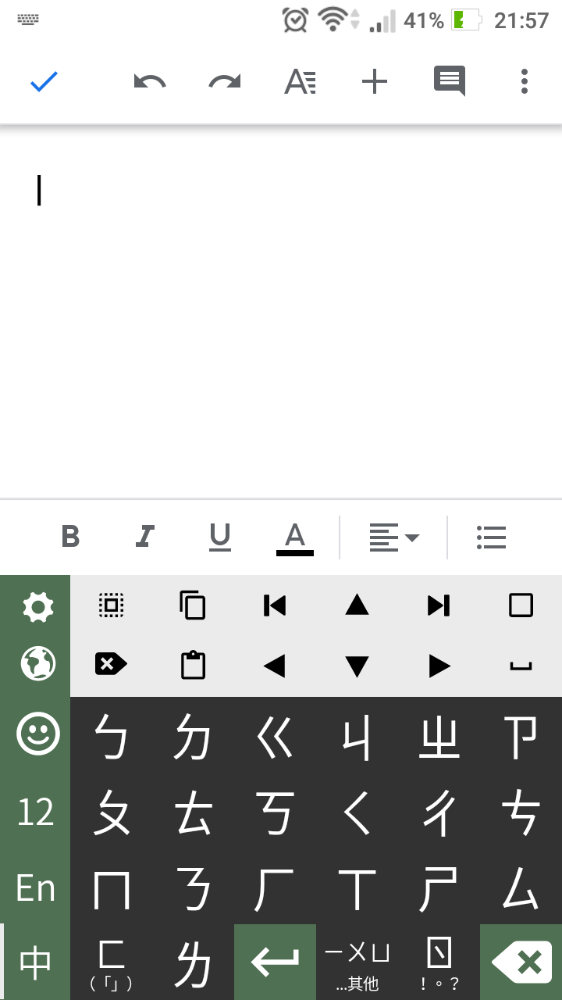

# Watermelon IME

A Chinese input method (IME) for Android.

* Dynamic 24-key keyboard for easier one-handed operation (compare to the denser traditional 42-key zhuyin keyboard layout)
* Constant 2 keystroke per character, instead of variable 1~4 keystroke, for more consistent typing speed.

**This repository is not being actively maintained**, it only serves as an archive of the idea. Because basically all Android phones nowadays have  big screens, input methods optimized for small screens and single-handed operation is not relevant anymore. 

## Screenshots

